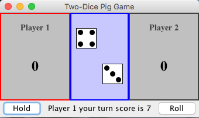

# ICS 111 Homework Assignment H10: Graphical Two Dice Pig

1) Modify your solution to [H07](../070.objects-classes/experience-H07.html) and [H09](experience-H09.html) to play a graphical game of Two-Dice Pig with two players.  

Your *JPanel* should have a sub-panel for each player showing their current score and a panel showing the die roll. On the bottom of the *JPanel* there should be buttons for rolling again and holding and a *JLabel* with the current turn score. The *PlayerPanel* whose turn it is should be highlighted.

Your game should look something like: 

You may use [my solution](two.zip), but if you do you need to add the following functionality to it.

1. Ask for the player names and use them.

2. Ask for the number of points to determine who wins and use it.

3. Inform the players what is going on with each roll.
   

## Turning in the Assignment

The assignment is due on Friday, November 11th at 11:55pm. You may turn it in early. 

1. Conduct a personal review of your code before turning it in. Does your code follow the [Java Coding Standard](../references/reading-java-coding-standard.html)?

   Is it clear and well commented?

2. Test your code.

    * Does it produce the correct output? 

3. Sign into Laulima, then navigate to the ICS111 site. In the left hand side of the site, there is an Assignments tab/link.  Click on it and view all of the posted assignments. Select the assignment that you want to turn in and attach your files and accept the honor pledge to submit the assignment.
  
