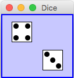
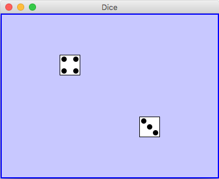

# Practice: Object Oriented Design

**Take out a piece of paper. We'll be programming on paper.**

### Problem 1

Write a *DicePanel* class that extends *JPanel*.  The *DicePanel* class must have an instance variable of type *GraphicalPairOfDice*. The *DicePanel*'s  *paintComponent(Graphics g)* method should use the instance variable's *drawDie(Graphics g, int dieNum, int x, int y)* method. The die is 35 pixels wide and high.
 
The panel should look something like:

### Problem 2

Update the *DicePanel* class so you can resize the panel and have the dice laid out like the following:

## Show me your code before you leave
