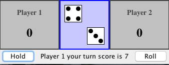

# Practice: TwoDicePigPanel

**Take out a piece of paper. We'll be programming on paper.**

### Problem 1

Create a *TwoDicePigPanel* class that extends *JPanel*.

It should look like .

It has two *PlayerPanel*s, a *DicePanel* and a *ButtonPanel*.
 
What is the constructor going to look like?

## Show me your code before you leave
